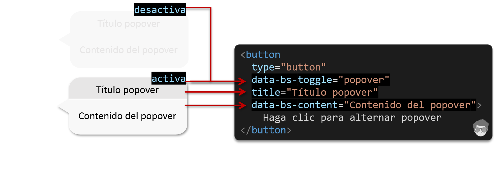

>**Nota** Los popover deben inicializarse con **JavaSscript** para que funcionen. Con el siguiente código podemos habilitar todos los popover que tenga el documento.
>```html
<script>
  const popoverTriggerList = [].slice.call(
      document.querySelectorAll('[data-bs-toggle="popover"]')
  )
</script>
>```

Para poder decirle que título, contenido y la forma de funcionar al popover, debemos tener en cuenta los siguientes atributos de meta-datos para el javascript de bootstrap:  


- `data-bs-toggle="popover"` : mostar/ocultar popover 
- `title="Título del popover"` : especifica el texto del encabezado o título
- `data-bs-content="Contenido del popover` : especifica el texto que debe mostrarse dentro del cuerpo de la ventana.

<p align="left">
	
</p>

Teniendo ahora el código necesario para poder crear un popover, veamos un ejemplo sencillo como acivar un popover desde un botón:

```html
<style>
    @import url('https://cdn.jsdelivr.net/npm/bootstrap@5.3.0-alpha3/dist/css/bootstrap.min.css');
</style>
<button 
  type="button" 
  class="btn btn-info" 
  data-bs-toggle="popover" 
  title="Popover título">
    Mostrar popover
</button>

<!-- Debemos incluir el JS de boostrap -->
<script 
  src="https://cdn.jsdelivr.net/npm/bootstrap@5.2.0-beta1/dist/js/bootstrap.bundle.min.js"
  crossorigin="anonymous"></script>
<!-- habilitar los popover para este documento -->
<script>
    const popoverTriggerList = [].slice.call(
        document.querySelectorAll('[data-bs-toggle="popover"]'));

    const popoverList = popoverTriggerList.map(function (popoverTriggerEl) {
        return new bootstrap.Popover(popoverTriggerEl)
    })
</script>
```


### Cambiar de dirección

Hay cuatro direcciones en cuanto la alineación: **superior**, **derecha**, **inferior**, **izquierda**. Las direcciones se reflejan cuando se usa Bootstrap en RTL.  


```html
<style>
    @import url('https://cdn.jsdelivr.net/npm/bootstrap@5.3.0-alpha3/dist/css/bootstrap.min.css');

    body {
      display: flex;
      justify-content: space-around;
      align-items: center;
      min-height: 100vh;
    }
</style>

<button
  type="button" 
  class="btn btn-secondary" 
  data-bs-container="body"
  data-bs-toggle="popover" 
  data-bs-placement="top" 
  data-bs-content="Contenido popover-top">
  Popover arriba
</button>

<button
  type="button" 
  class="btn btn-secondary" 
  data-bs-container="body" 
  data-bs-toggle="popover" 
  data-bs-placement="right" 
  data-bs-content="Contenido popover-right">
  Popover derecha
</button>

<button
  type="button" 
  class="btn btn-secondary" 
  data-bs-container="body" 
  data-bs-toggle="popover" 
  data-bs-placement="left" 
  data-bs-content="Contenido popover-left">
  Popover izquierda
</button>

<button
  type="button" 
  class="btn btn-secondary" 
  data-bs-container="body" 
  data-bs-toggle="popover" 
  data-bs-placement="bottom" 
  data-bs-content="Contenido popover-bottom">
  Popover abajo
</button>

<!-- habilitar los popover -->
<script type="module">
// incluir el JS de boostrap
import "https://cdn.jsdelivr.net/npm/bootstrap@5.2.0-beta1/dist/js/bootstrap.bundle.min.js";

  const popoverTriggerList = [].slice.call(
     document.querySelectorAll('[data-bs-toggle="popover"]'));

  const popoverList = popoverTriggerList.map(function (popoverTriggerEl) {
     return new bootstrap.Popover(popoverTriggerEl)
  })
</script>
```


### Uso de la opción container

Cuando tenemos algunos estilos en un elemento principal como sería nuestro <span class="tag">body</span> que interfieren con la ventana emergente *popover*, nos puede interesar especificar un **`container`** personalizado para que el **HTML** de la ventana emergente aparezca dentro de ese elemento.


```js
var popover = new bootstrap.Popover(document.querySelector('.example-popover'), {
  container: 'body'
})
```